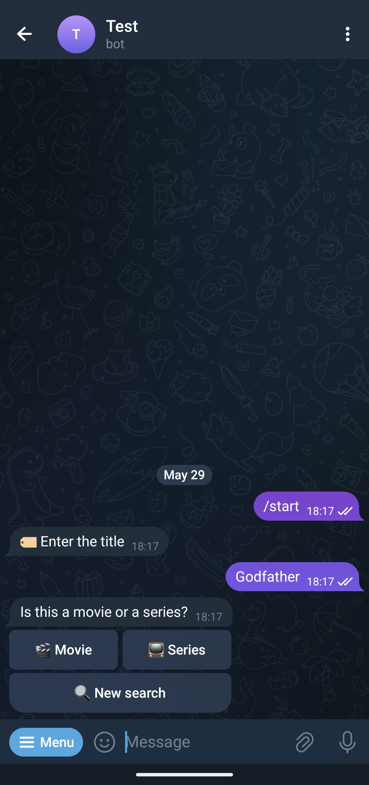
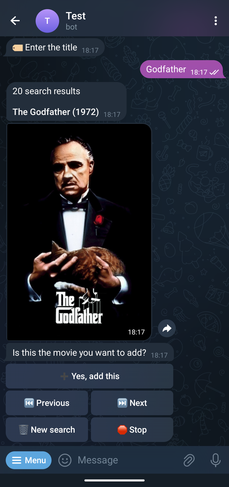

# ADDARR

This Telegram bot makes it easy to manage your media library right from your chat. Add or delete series to [Sonarr](https://github.com/Sonarr/Sonarr) or movies to [Radarr](https://github.com/Radarr/Radarr) using simple, interactive commands. You can view a full list of your series and movies, and get notified when media you've added has finished downloading.

In addition to media management, the bot also integrates with [Transmission](https://transmissionbt.com/), [SABnzbd](https://sabnzbd.org) and [qBittorrent](https://www.qbittorrent.org/) to let you temporarily adjust download and upload speeds directly from the chat.

To make the bot accessible to a wider audience, it's available in multiple languages, including English, Dutch, Spanish, Italian, Portuguese, Polish, German, French and Russian.

All commands are easily accessible through Telegram’s InlineKeyboard interface.

## FEATURES

- Sonarr & Radarr
  - Add series and movies
  - Supports multiple instances
  - Get a list of all the series and movies
  - Notifications to each user from Sonarr/Radarr when media that user added has been downloaded
- Transmission, SABnzbd and qBittorrent
  - Change download and upload speed
- Authentication & Security
  - Secure bot with a password. New chats first need to authenticate
  - Wrong login attempts are saved in `addarr.log`
  - Possibility to enable the list all, delete and Transmission/SABnzbd/qBittorrent-commands only for admins
- Configuration
  - Possibility to change the entrypoints of the commands
  - Translated in English (US), Dutch (Belgium), Spanish (Spain), Italian (Italy), Portuguese (Portugal), Polish (Poland), German (Germany), French (France) and Russian (Russia)
  - Command to give an overview of all the other commands

> [!IMPORTANT]  
> Addarr only works with Sonarr V4, because of some breaking API changes between V3 and V4.

## COMMANDS

These are the default commands:

- `/help`: gives an overview of all the commands with their action
- `/stop`: stops the command you were executing. Can be used at any moment
- `/auth`: authenticate the chat to use this bot
- `/start`: start adding a series or movie to Sonarr/Radarr
- `/delete`: remove a series or movie from Sonarr/Radarr
- `/allMovies`: receive a list of all the movies on Radarr
- `/allSeries`: receive a list of all the series on Sonarr
- `/movie` | `/film` | `/filme` | `/película`: start adding a movie to Radarr  
  You can also pass the title after the command: `/movie Godfathers` or the IMDB/TMDB ID: `/movie imdb:tt0068646`
- `/series` | `/serie`: start adding a series to Sonarr
  You can also pass the title after the command: `/series Friends` or the TVDB ID: `/series tvdb:79168`
- `/notify`: creates a notification profile for Telegram in Sonarr/Radarr. Users will be notified when the media they've added, has been downloaded
- `/sabnzbd`: change the download/upload speed of SABnzbd to 25%, 50% or 100% of the defined limit
- `/transmission`: change the download/upload speed of Transmission from Temporary Speed Limit to normal or the other way around
- `/qbittorrent`: change the global download/upload rate limit of qBitorrent to alternative rate or normal rate

Every command does also work if you send a message without `/` and no other words before or after the entrypoint

### Single Line Commands

Single line commands allow you to skip multiple steps of the process

- `{movie | series} {title}`: will bring you directly to the 'Is this the media you want to add' step. If you have multiple instances of Sonarr/Radarr, you will first need to select to which instance you want to add the title.  
  For example if you want to find the movie 'Godfather', you would type `movie Godfather`. To find a TV show, you need to enter `series Friends`.

## CONFIG

An example configuration file, `config_example.yaml`, is included in this repository. Copy and modify it to match your setup. Once you’ve filled in all the required fields, rename the file to `config.yaml`.

## ADMIN

You can restrict access to the following commands to admins only:

- Changing download/upload speed of Transmission, SABnzbd or qBittorrent
- List all series or movies
- Deleting a series pr movie

To enable this functionality:

1. Set the relevant admin options to true in your `config.yaml` file
2. Add admin users to `admin.txt`. You can use either their Telegram username or user ID
   - Add each admin on a separate line to avoid parsing errors

## ALLOWLIST

For stricter access control, the bot can be set to only respond to pre-approved users.

To enable this feature:

1. Set the allowlist option to true in config.yaml
1. Add allowed users to `allowlist.txt`, using their username or user ID
   - Add each user on a new line to ensure proper functionality

## INSTALLATION

You can find the installation guides on the [wikipage](https://github.com/Waterboy1602/Addarr/wiki).

- [FreeBSD](https://github.com/Waterboy1602/Addarr/wiki/Installation-on-FreeBSD)
- [Docker](https://github.com/Waterboy1602/Addarr/wiki/Installation-on-Docker)
- [Windows](https://github.com/Waterboy1602/Addarr/wiki/Installation-on-Windows)
- [Linux](https://github.com/Waterboy1602/Addarr/wiki/Installation-on-Linux)

## SCREENSHOTS

    
    
    

